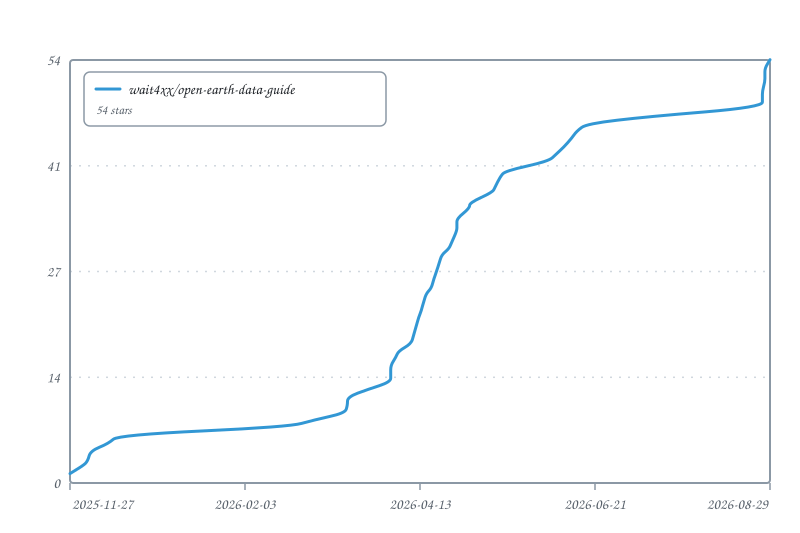

<div align="center">

# 🌍 Public Earth-System Data Download Resource Guide

**A one-stop index of public meteorological · oceanographic · climate · environmental data, with download channels, access notes and companion scripts**

[](https://github.com/wait4xx/open-earth-data-guide/stargazers)
[](https://github.com/wait4xx/open-earth-data-guide/network/members)
[](#license)
[](https://github.com/wait4xx/open-earth-data-guide/commits)
[](CONTRIBUTING_EN.md)

🌍 Global data sources · 📥 Companion scripts · 🔄 Continuously updated · 🤝 Contributions welcome

`Meteorological` `NWP` `AI Models` `Reanalysis` `Climate` `Observations` `Satellite` `Radar` `Air Quality` `Marine` `Marine Obs` `SST/Sea Ice` `Marine Models`

[中文](README.md) · **English**

</div>

> 📌 A curated collection of download channels and access notes for public meteorological, oceanographic, climate and environmental data, providing convenient data access for research, analysis and application development.

---

### 🧩 Companion Toolkit: [Open Earth Data Kit](https://github.com/wait4xx/open-earth-data-kit)

This repository is the **resource guide** — it focuses on “what data exists and where to download it”, collecting public data-source links, access notes and companion download scripts. If you’d rather converge these sources into a **unified command-line download platform**, check out its sibling project:

> 🌍 **[Open Earth Data Kit](https://github.com/wait4xx/open-earth-data-kit)** · Unified CLI toolkit for public earth-system data access
>
> Provides the `meteo` CLI (`list` / `info` / `plan` / `download` / `tasks`), a structured data-source catalog (59 sources), multi-protocol adapters (HTTP index / S3 / OPeNDAP / Zarr), swappable download backends (Python / IDM / XDM), and SQLite-based task state tracking.

**In short: the Guide tells you *where* to download, the Kit downloads *for you*.** The two share the same origin and complement each other — usable independently or together.

---

### 📢 Latest Updates
> **2026-07-26** · 🤖 AI-model section expanded: inlined the `noaa-oar-mlwp-data` S3 bucket **directory structure & naming** (model code `FOUR`/`PANG`/`GRAP`, version, `GFS`/`IFS` init system, init time, forecast-hour fields) and the **FourCastNet v1 / v2-small / Pangu-Weather / GraphCast Operational** variable lists into the AI Model Collection entry (zh + en), so key access details no longer live only behind the linked txt file
>
> **2026-06-20** · 🗂️ Restructured IRI Data Library & CMEMS entries: IRI is now a "Reanalysis" entrypoint with datasets distributed into their topical sections by data type (each tagged `via IRI`, with **login-verified** `SOURCES/...` paths); added COADS / Levitus / ISCCP / NMME / ENSO-PDO-QBO entries. CMEMS split into a portal block + GLORYS / WAVERY / BGC / DUACS / OSTIA standalone entries (OPeNDAP/THREDDS retired, now via Marine Data Store). Live probing found IRI does NOT host ERA5 / MERRA-2 / SODA — removed from entries.
>
> **2026-06-18** · 🔐 Added IRI Data Library; expanded NASA Earthdata entries (MERRA-2 / GPM IMERG / MODIS LST / AIRS / CERES / CALIPSO / AVHRR OI SST / CCMP Winds / OSCAR / SMAP / GRACE-FO / GLDAS / NSIDC Sea Ice CDR / MODIS Snow Cover) and CMEMS with authentication requirements & short_names; all entries connectivity-verified
>
> **2026-06-13** · 🎉 Major update: added 18 public data sources (climate / observations / satellite / marine / air quality); open-source tools expanded to 20 as category tables; added MIT License & Star History; bilingual docs fully synced
>
> **2026-05-21** · 📝 Added Planette ERA5 AWS S3 download script for ERA5 daily, weekly and monthly mean data (`era5_planette_downloader.py`), supporting multi-variable concurrency, unit conversion, real-time progress
>
> **2026-04-11** · 📝 Added tutorial for ERA5 AWS S3 multi-threaded download script (`s3_downloader_multi.py`)
>
> **2026-03-03** · 🎇 Updated README, improved display
>
> **2025-12-09** · ✨ ECMWF download script upgraded — now supports **IFS / EFS / AIFS / AIEFS** full data series
>
> **2025-12-05** · 🚀 ECMWF download script released — supports **4-thread parallel downloads**, significantly improving efficiency

---

### 🔧 Project Progress

| Category | Sub-category | Status |
|:--------:|:-----|:----:|
| 🌐 Met | Numerical Weather Prediction | ✅ |
| | AI Model Forecasts | ✅ |
| | Reanalysis | ✅ |
| | Climate Data | ✅ |
| | Observations | ✅ |
| | Satellite | ✅ |
| | Radar | ✅ |
| | Air Quality | ✅ |
| 🌊 Marine | Marine Observations | ✅ |
| | SST & Sea Ice | ✅ |
| | Marine Models | ✅ |
| | Ocean Color | ✅ |
| 🛠️ Tools | Open Source Tools | ✅ |

---

## 📚 Contents

| Data Types | Tools & Community |
|:--------:|:----------:|
| **[🌐 Meteorological Data](#meteorological-data)** · [NWP](#numerical-weather-prediction) · [AI Models](#ai-model-forecasts) · [Reanalysis](#reanalysis) · [Climate](#climate-data) · [Observations](#observations) · [Satellite](#satellite) · [Radar](#radar) · [Air Quality](#air-quality) | [Contributing](#contributing) · [License](#license) |
| **[🌊 Marine Data](#marine-data)** · [Marine Obs](#marine-observations) · [SST/Sea Ice](#sst--sea-ice) · [Marine Models](#marine-models) · [Ocean Color](#ocean-color) | [Open Source Tools](#open-source-tools) · [Acknowledgements](#acknowledgements) |


## Meteorological Data

### Numerical Weather Prediction

#### Real-time Forecasts

<details>
<summary><b>ECMWF</b> · European Centre for Medium-Range Weather Forecasts</summary>

---

**IFS** · Deterministic Forecast


_144~360h(6h)-green?style=flat-square)


🔗 [ECMWF Open Data](https://data.ecmwf.int/forecasts/) · 📅 Last 4 days

---

**EFS** · Ensemble Forecast


_144~360h(6h)-green?style=flat-square)


🔗 [ECMWF Open Data](https://data.ecmwf.int/forecasts/) · 📅 Last 4 days

---

**IFS Data Format Guide**

> 


</details>

<details>
<summary><b>NCEP</b> · Global Forecast System (USA)</summary>

---

**GFS** · Deterministic Forecast


_144~360h(6h)-green?style=flat-square)


🔗 [GFS_UCAR](https://motherlode.ucar.edu/native/grid/NCEP/GFS/) · 📅 Last 3 months

---

**GFS** · Deterministic Forecast


_120~384h(3h)-green?style=flat-square)


🔗 [GFS_NOAA](https://nomads.ncep.noaa.gov/pub/data/nccf/com/gfs/) · 📅 Last 10 days

---

**GFS OPeNDAP** · ⚠️ Retired


> ❌ NOMADS GFS OPeNDAP endpoints (`gfs_0p25_1hr` / `gfs_0p25` / `gfs_0p50` / `gfs_1p00`) were all retired in 2025 (Service Change Notice 25-81). Alternatives: raw GRIB via [GFS_NOAA](https://nomads.ncep.noaa.gov/pub/data/nccf/com/gfs/) above, [GFS_UCAR](https://motherlode.ucar.edu/native/grid/NCEP/GFS/) THREDDS; historical climate/reanalysis data see [NOAA PSL THREDDS](#reanalysis) below.

---

**GEFS** · Ensemble Forecast


-green?style=flat-square)


🔗 [GEFS_NOAA](https://nomads.ncep.noaa.gov/pub/data/nccf/com/gens/) · 📅 Last 4 days

---

**GEFS** · Ensemble Forecast


_240~840h(6h)-green?style=flat-square)


🔗 [GEFS_NOAA](https://nomads.ncep.noaa.gov/pub/data/nccf/com/gens/) · 📅 Last 4 days

</details>

<details>
<summary><b>DWD</b> · German Weather Service</summary>

---

**ICON** · Deterministic Forecast


_144~360h(6h)-green?style=flat-square)


🔗 [ICON Open Data](https://opendata.dwd.de/weather/nwp/icon/grib/) · 📅 Last 4 runs

</details>

<details>
<summary><b>JMA</b> · Japan Meteorological Agency (no direct download, account required)</summary>

---

**GSM** · Deterministic Forecast


_144~360h(6h)-green?style=flat-square)


🔗 [JMA GSM](https://www.wis-jma.go.jp/cms/gsm/download.html) · 📅 Last 5 days

</details>


#### Historical Forecasts

<details>
<summary><b>ECMWF</b> · European Centre for Medium-Range Weather Forecasts</summary>

---

**IFS (HRES ~ surface)** · Deterministic Forecast


-green?style=flat-square)


🔗 [IFS_UCAR](https://gdex.ucar.edu/datasets/d113001/dataaccess/#) · 📅 2016-01-01 to present

---

**IFS** · Deterministic Forecast


_144~360h(6h)-green?style=flat-square)


🔗 [🪜 ECMWF_GOOGLE](https://console.cloud.google.com/storage/browser/ecmwf-open-data) · 📅 2023-07-12 to present (with delay)

---

**IFS** · Deterministic Forecast


_144~360h(6h)-green?style=flat-square)


🔗 [AWS-S3](https://ecmwf-forecasts.s3.amazonaws.com/) · 📅 2023-03-18 to present · ⚠️ awscli or full URL required

---

**EFS** · Ensemble Forecast


_144~360h(6h)-green?style=flat-square)


🔗 [🪜 ECMWF_GOOGLE](https://console.cloud.google.com/storage/browser/ecmwf-open-data) · 📅 2023-07-12 to present (with delay)

---

**EFS** · Ensemble Forecast


_144~360h(6h)-green?style=flat-square)


🔗 [AWS-S3](https://ecmwf-forecasts.s3.amazonaws.com/) · 📅 2023-03-18 to present · ⚠️ awscli or full URL required

</details>

<details>
<summary><b>NCEP</b> · Global Forecast System (USA)</summary>

---

**GFS** · Deterministic Forecast


_240~384h(12h)-green?style=flat-square)


🔗 [GFS_UCAR](https://gdex.ucar.edu/datasets/d084001/dataaccess/) · 📅 2015-01-15 to present (discontinued 2026)

---

**GFS** · Deterministic Forecast


-green?style=flat-square)


🔗 [AWS-S3](https://noaa-gfs-bdp-pds.s3.amazonaws.com/index.html) · 📅 2021-01-01 to present · 🔍 search `gfs`

---

**GFS** · Deterministic Forecast


-green?style=flat-square)


🔗 [🪜 GFS_GOOGLE](https://console.cloud.google.com/storage/browser/global-forecast-system) · 📅 2021-01-01 to present · 🔍 search `gfs`

---

**GEFS** · Ensemble Forecast


_0~240h(3h)-green?style=flat-square)


🔗 [AWS-S3](https://noaa-gefs-pds.s3.amazonaws.com/index.html) · 📅 2017-01-01 to present

---

**GEFS** · Ensemble Forecast


-green?style=flat-square)


🔗 [🪜 GFS_GOOGLE](https://console.cloud.google.com/storage/browser/gfs-ensemble-forecast-system) · 📅 2020-09-25 to present

</details>

<details>
<summary><b>NMME</b> · North American Multi-Model Ensemble seasonal forecast · via IRI (dlauth) · OPeNDAP</summary>


North American Multi-Model Ensemble: multi-institution coupled-model seasonal forecasts + hindcasts (CFSv2, GFDL, NASA GEOS-5, NCAR CCSM, CanCM, …); a primary input to NOAA CPC seasonal outlooks.

🔗 via [IRI Data Library](https://iridl.ldeo.columbia.edu/) (dlauth): `SOURCES/Models/.NMME`

</details>

### AI Model Forecasts

#### Real-time Data

<details>
<summary><b>ECMWF</b> · European Centre for Medium-Range Weather Forecasts</summary>

---

**AIFS** · Deterministic Forecast


-green?style=flat-square)


🔗 [ECMWF Open Data](https://data.ecmwf.int/forecasts/) · 📅 Last 4 days

---

**AIEFS** · Ensemble Forecast


-green?style=flat-square)


🔗 [ECMWF Open Data](https://data.ecmwf.int/forecasts/) · 📅 Last 4 days

</details>

<details>
<summary><b>NCEP</b> · Global Forecast System (USA)</summary>

---

**AIGFS** · Deterministic Forecast


-green?style=flat-square)


🔗 [AIGFS_NOAA](https://nomads.ncep.noaa.gov/pub/data/nccf/com/aigfs/) · 📅 Last 2 days

---

**AIGEFS** · Ensemble Forecast


-green?style=flat-square)


🔗 [AIGEFS_NOAA](https://nomads.ncep.noaa.gov/pub/data/nccf/com/aigefs/) · 📅 Last 2 days

</details>

<details>
<summary><b>AI Model Collection</b> · Aurora / FourCastNet / GraphCast / PANGU</summary>

---

**Aurora** · Microsoft · Deterministic Forecast


-green?style=flat-square)


🔗 [AWS-S3](https://noaa-oar-mlwp-data.s3.amazonaws.com/index.html) · 📝 [Data notes](./docs/noaa-oar-mlwp-data.txt)

---

**FourCastNet** · NVIDIA · Deterministic Forecast


-green?style=flat-square)


🔗 [AWS-S3](https://noaa-oar-mlwp-data.s3.amazonaws.com/index.html) · 📝 [Data notes](./docs/noaa-oar-mlwp-data.txt)

---

**GraphCast** · Google / DeepMind · Deterministic Forecast


-green?style=flat-square)


🔗 [AWS-S3](https://noaa-oar-mlwp-data.s3.amazonaws.com/index.html) · 📝 [Data notes](./docs/noaa-oar-mlwp-data.txt)

---

**PANGU** · Huawei · Deterministic Forecast


-green?style=flat-square)


🔗 [AWS-S3](https://noaa-oar-mlwp-data.s3.amazonaws.com/index.html) · 📝 [Data notes](./docs/noaa-oar-mlwp-data.txt)

</details>

#### Historical Data

<details>
<summary><b>ECMWF</b> · European Centre for Medium-Range Weather Forecasts</summary>

---

**AIFS** · Deterministic Forecast


-green?style=flat-square)


🔗 [AWS-S3](https://ecmwf-forecasts.s3.amazonaws.com/) · 📅 2024-02-29 to present · ⚠️ awscli or full URL required

---

**AIEFS** · Ensemble Forecast


-green?style=flat-square)


🔗 [AWS-S3](https://ecmwf-forecasts.s3.amazonaws.com/) · ⚠️ awscli or full URL required

</details>

<details>
<summary><b>AI Model Collection</b> · Aurora / FourCastNet / GraphCast / PANGU</summary>

<details>
<summary>📖 Directory structure & naming</summary>

Public S3 bucket `noaa-oar-mlwp-data` (AWS, no auth). File path:

```
s3://noaa-oar-mlwp-data/MMMM_vNNN_III/YYYY/mmdd/MMMM_vNNN_III_YYYYmmddhh_fXXX_fYYY_ZZ.nc
```

| Field | Meaning | Values |
|:----:|:-----|:-----|
| `MMMM` | Model code | `FOUR` / `PANG` / `GRAP` |
| `NNN` | Version | `100`, `200` |
| `III` | Initial-condition system | `GFS` (full period); `IFS` (from 2025-01) |
| `YYYY`/`mm`/`dd` | Init date | year / month / day |
| `hh` | Init time (UTC) | `00`, `06`, `12`, `18` |
| `XXX` / `YYY` | First / last forecast hour in file | `000` / `240` |
| `ZZ` | Forecast step (h) | `06` |

Init times: 00 / 12 UTC available all years; 06 / 18 UTC available for 2023 only.

</details>

<details>
<summary>📋 Variables by model</summary>

**FourCastNet v1**: 10 m / 100 m wind (u, v), 2 m temp, surface pressure, MSL pressure, total column water vapor; geopotential / temperature / u-v wind (1000, 850, 500, 250 hPa; geopotential also 50 hPa); relative humidity (850, 500 hPa).

**FourCastNet v2-small**: 10 m / 100 m wind (u, v), 2 m temp, surface pressure, MSL pressure, total column water vapor; geopotential / temperature / u-v wind / relative humidity (1000, 925, 850, 700, 600, 500, 400, 300, 250, 200, 150, 100, 50 hPa).

**Pangu-Weather**: 10 m wind (u, v), 2 m temp, MSL pressure; geopotential / temperature / u-v wind / specific humidity (1000, 925, 850, 700, 600, 500, 400, 300, 250, 200, 150, 100, 50 hPa).

**GraphCast Operational**: 10 m wind (u, v), 2 m temp, MSL pressure; geopotential / temperature / u-v wind / specific humidity / vertical velocity (same 13 levels); 6-h accumulated precipitation.

</details>

---

**Aurora** · Microsoft · Deterministic Forecast


-green?style=flat-square)


🔗 [AWS-S3](https://noaa-oar-mlwp-data.s3.amazonaws.com/index.html) · 📅 2025-01-23 to present · 📝 [Data notes](./docs/noaa-oar-mlwp-data.txt)

---

**FourCastNet** · NVIDIA · Deterministic Forecast


-green?style=flat-square)


🔗 [AWS-S3](https://noaa-oar-mlwp-data.s3.amazonaws.com/index.html) · 📅 2020-09-30 to present · 📝 [Data notes](./docs/noaa-oar-mlwp-data.txt)

---

**GraphCast** · Google / DeepMind · Deterministic Forecast


-green?style=flat-square)


🔗 [AWS-S3](https://noaa-oar-mlwp-data.s3.amazonaws.com/index.html) · 📅 2020-09-30 to present · 📝 [Data notes](./docs/noaa-oar-mlwp-data.txt)

---

**PANGU** · Huawei · Deterministic Forecast


-green?style=flat-square)


🔗 [AWS-S3](https://noaa-oar-mlwp-data.s3.amazonaws.com/index.html) · 📅 2020-09-30 to present · 📝 [Data notes](./docs/noaa-oar-mlwp-data.txt)

</details>

### Reanalysis

<details>
<summary><b>ERA5-land</b> · ECMWF land reanalysis</summary>

***Without VPN, AWS + IDM multi-threaded download is recommended for the fastest speed.***

---

**ERA5-land (hourly)**


🔗 [ERA5-land](https://cds.climate.copernicus.eu/datasets/reanalysis-era5-land?tab=download)

---

**ERA5-land (hourly)**


🔗 [AWS-S3](https://nsf-ncar-era5.s3.amazonaws.com/index.html#e5.oper.an.sfc/) · 📅 3-4 month delay · 📝 [Python multi-thread script](./sources/s3_downloader_multi.py)

<details>
<summary>📖 s3_downloader_multi.py tutorial</summary>

---

**Overview**

`s3_downloader_multi.py` is a smart concurrent download script for ERA5 data on AWS S3. It calls IDM or XDM for multi-task parallel download, supporting resume, byte-level verification and auto-skip of completed files.

**Dependencies**

```bash
pip install requests beautifulsoup4 lxml
```

Also install one of:
- **IDM** (Windows, recommended): [Internet Download Manager](https://www.internetdownloadmanager.com/)
- **XDM** (cross-platform): [Xtreme Download Manager](https://xtremedownloadmanager.com/)

**Configure the download tool path**

Edit the `Config` class in the script:

```python
class Config:
    DOWNLOAD_TOOL = "idm"   # or "xdm"
    IDM_PATH = r"D:\Program Files (x86)\Internet Download Manager\IDMan.exe"
    XDM_PATH_LINUX  = "/opt/xdman/xdman"
    XDM_PATH_WINDOWS = r"C:\Program Files\XDM\xdman.exe"
```

**Command-line mode (recommended)**

```bash
python s3_downloader_multi.py -v <variables> -y <year range> -o <output dir> [options]
```

| Flag | Description | Example |
|------|-------------|---------|
| `-v` | Variable name(s), comma-separated | `2t` / `2t,10u,10v` |
| `-y` | Year range, single or interval | `2024` / `2020-2024` |
| `-m` | Months, comma-separated (default all year) | `1,2,3` |
| `-o` | Local output directory | `./era5_data` |
| `-t` | Download tool, `idm` or `xdm` (default `idm`) | `idm` |
| `-c` | Max concurrency (default 6) | `4` |
| `--dry-run` | Preview mode, no actual download | — |
| `--export` | Export file list as CSV/TXT | — |
| `--delay` | Data delay in months (default 5) | `3` |

**Examples**

```bash
# Preview 2024 2m temperature (no download)
python s3_downloader_multi.py -v 2t -y 2024 -o ./era5_data --dry-run --export

# Download 2023-2024 2m temp + 10m wind, 6-thread concurrent
python s3_downloader_multi.py -v 2t,10u,10v -y 2023-2024 -o ./era5_data -c 6

# Only Jun-Aug 2024 surface pressure
python s3_downloader_multi.py -v sp -y 2024 -m 6,7,8 -o ./era5_data
```

**Supported datasets (change `DATASET_PREFIX`)**

| Prefix | Description | Vars |
|--------|-------------|------|
| `e5.oper.an.sfc` | Surface analysis (default) | 62 |
| `e5.oper.an.pl` | Pressure-level analysis | 16 |
| `e5.oper.an.vinteg` | Vertically integrated | 36 |
| `e5.oper.fc.sfc.accumu` | Surface forecast accumulation | 38 |
| `e5.oper.fc.sfc.instan` | Surface forecast instantaneous | 14 |
| `e5.oper.fc.sfc.meanflux` | Surface forecast mean flux | 39 |
| `e5.oper.fc.sfc.minmax` | Surface forecast extremes | 5 |
| `e5.oper.invariant` | Constant invariants | 14 |

> The full variable tables for each dataset (codes, meaning, units) are in [README.md (中文)](README.md). Common surface variables: `2t` (2m temp), `2d` (2m dewpoint), `10u/10v` (10m wind), `100u/100v` (100m wind), `sp` (surface pressure), `msl` (MSL pressure), `tp`/`cp`/`lsp` (precipitation), `sd` (snow depth), `tcc/lcc/mcc/hcc` (cloud cover), `cape`, `blh`, soil temp/moisture (`stl1-4`, `swvl1-4`), etc.

**Notes**

- Data is usually delayed ~3-5 months; the script auto-skips unpublished months.
- Downloads are handed to IDM/XDM; completion is judged by scanning local file sizes.
- Logs are written to `download_log.txt` in the working directory.
- Fully downloaded files (≥ 99% of expected) are auto-skipped; resume is supported.

</details>

---

**ERA5-land (monthly)**


🔗 [ERA5-land (monthly)](https://cds.climate.copernicus.eu/datasets/reanalysis-era5-land-monthly-means?tab=download)

---

**ERA5-land (daily / 7-day / monthly / 3-month)**


🔗 [AWS-S3](https://planette-era5.s3.amazonaws.com/index.html#era5/) · 📅 3-4 month delay · Zarr format · 📝 [Python script](./sources/era5_planette_downloader.py)

<details>
<summary>📖 era5_planette_downloader.py tutorial</summary>

---

**Overview**

`era5_planette_downloader.py` downloads ERA5 from the Planette AWS S3 bucket, supporting multi-variable concurrency, automatic unit conversion, spatial/temporal subsetting, and real-time progress/speed display.

**Dependencies**

```bash
pip install xarray icechunk s3fs numpy netcdf4 requests dask
```

**Basic usage**

```bash
python era5_planette_downloader.py -v <variables> -f <frequency> -o <output path> [options]
```

| Flag | Description | Example |
|------|-------------|---------|
| `-v` | Variable(s), space-separated | `t2m` / `t2m pr slp` |
| `-f` | Temporal frequency | `day` / `7day` / `month` / `3month` |
| `-g` | Grid resolution (default 0p25latx0p25lon) | `0p25latx0p25lon` |
| `-t` | Time range (YYYY-MM-DD) | `2020-01-01 2024-12-31` |
| `-r` | Spatial subset (lon_min lon_max lat_min lat_max) | `70 140 15 55` |
| `-o` | Output file or dir (dir = multi-variable) | `./t2m.nc` / `./output/` |
| `--format` | Output format (default netcdf4) | `netcdf4` / `zarr` |
| `--auto-name` | Auto-generate filename | — |
| `--concurrent` | Multi-variable concurrent download | — |
| `--workers` | Concurrent workers (default 4) | `8` |
| `--no-convert` | Disable unit conversion | — |
| `--no-resume` | Disable resume | — |
| `--list-variables` | List S3 variables | — |

**Examples**

```bash
# List available variables
python era5_planette_downloader.py --list-variables

# Download monthly 2m temp (2020-2024)
python era5_planette_downloader.py -v t2m -f month -t 2020-01-01 2024-12-31 -o ./t2m_monthly.nc

# Download and clip to China region
python era5_planette_downloader.py -v t2m -f month -t 2020-01-01 2020-12-31 -r 70 140 15 55 -o ./t2m_china.nc

# Multi-variable concurrent + auto naming
python era5_planette_downloader.py -v t2m pr slp -f month -t 2020-01-01 2024-12-31 -o ./output/ --auto-name --concurrent
```

**Supported variables (64 total)**

> Use `--list-variables` for the live list. The script auto-converts units for common variables (e.g. `t2m` K→°C, `ps`/`slp` Pa→hPa). Includes: surface (`t2m`, `t2m_max/min`, `td2m`, `ts`, `sst`, `ps`, `slp`, `pr`, `tcwv`, `cape`, `olr`, `sic`), wind (`u10m/v10m`, `u100m/v100m`, `tau_x/y`), pressure-level (`u/v/t/z/w/q` at 10/50/100/200/500/700/850 hPa), soil moisture (`swv_1-4`). The full variable list with units/conversions is in [README.md (中文)](README.md).

> ⚠️ **OLR sign**: ERA5 native `ttr` is positive downward, so OLR (positive upward) is usually `OLR = -ttr`.
> ⚠️ **Precipitation**: if the source is `tp` (m), convert to mm/day with `×1000×24`.

**Notes**

- Data is **Icechunk Zarr**, accessed via the Icechunk library (different from direct GRIB/NetCDF download).
- Output is standard **NetCDF4** or **Zarr**, openable directly with `xarray`.

</details>

---

**ERA5 (hourly/monthly)**


🔗 [🪜 ERA5_GOOGLE](https://console.cloud.google.com/storage/browser/gcp-public-data-arco-era5/raw/ERA5GRIB/HRES)

</details>

<details>
<summary><b>ERA5-pressure</b> · ECMWF pressure-level reanalysis</summary>

***Without VPN, AWS + IDM multi-threaded download is recommended for the fastest speed.***

---

**ERA5-pressure (hourly)**


🔗 [ERA5-pressure](https://cds.climate.copernicus.eu/datasets/reanalysis-era5-pressure-levels?tab=download)

---

**ERA5-pressure (hourly)**


🔗 [AWS-S3](https://nsf-ncar-era5.s3.amazonaws.com/index.html#e5.oper.an.pl/) · 📅 3-4 month delay · 📝 [Python multi-thread script](./sources/s3_downloader_multi.py) (set `DATASET_PREFIX` to `e5.oper.an.pl`)

---

**ERA5-pressure (monthly)**


🔗 [ERA5-pressure (monthly)](https://cds.climate.copernicus.eu/datasets/reanalysis-era5-pressure-levels-monthly-means?tab=download)

---

**ERA5-pressure (daily / 7-day / monthly / 3-month)**


🔗 [AWS-S3](https://planette-era5.s3.amazonaws.com/index.html#era5/) · 📅 3-4 month delay · Zarr format · 📝 [Python script](./sources/era5_planette_downloader.py)

---

**ERA5 (hourly/monthly)**


🔗 [🪜 ERA5_GOOGLE](https://console.cloud.google.com/storage/browser/gcp-public-data-arco-era5/raw/ERA5GRIB/HRES)

</details>


<details>
<summary><b>FNL</b> · NCEP Final Analysis</summary>

---

**FNL**


🔗 [FNL_UCAR](https://gdex.ucar.edu/datasets/d083003/dataaccess/#)

---

**FNL**


🔗 [FNL_UCAR](https://gdex.ucar.edu/datasets/d083002/dataaccess/#)

</details>

<details>
<summary><b>JRA-3Q</b> · JMA Reanalysis</summary>

---

**DIAS**


🔗 [JRA-3Q_DIAS](https://data.diasjp.net/dl/storages/filelist/dataset:645) · ⚠️ Login required

---

**UCAR (historical)**


🔗 [JRA-3Q_UCAR](https://gdex.ucar.edu/datasets/d640000/dataaccess/#)

---

**UCAR (near-real-time)**


🔗 [JRA-3Q_UCAR](https://gdex.ucar.edu/datasets/d640001/dataaccess/#) · 🔄 near-real-time

---

**UCAR (monthly)**


🔗 [JRA-3Q_UCAR](https://gdex.ucar.edu/datasets/d640002/dataaccess/#)

</details>

<details>
<summary><b>MERRA-2</b> · NASA Reanalysis · 🔒 Earthdata Login</summary>


⚠️ **Requires free [Earthdata Login](https://urs.earthdata.nasa.gov/) registration; use `earthaccess` library for automatic authentication & S3 credential handling.**

Key short_names: `M2T1NXSLV` (2D hourly surface T2M/SLP/wind), `M2I1NXASM` (2D instantaneous analysis), `M2T1NXFLX` (hourly flux/precipitation), `M2I3NPASM` (3D 3-hourly pressure levels, 72 layers).

Protocols: OPeNDAP/DAP4 streaming + AWS S3 (requester-pays, `earthaccess.open()` auto-swaps credentials for bulk download).

🔗 [GES DISC](https://disc.gsfc.nasa.gov/datasets?project=MERRA-2) · [FTP](https://goldsmr4.gesdisc.eosdis.nasa.gov/data/)

</details>

<details>
<summary><b>NCEP/NCAR R1</b> · Classic global reanalysis · OPeNDAP</summary>


Surface (slp/air/pr_wtr/rhum), 17 pressure levels (hgt/uwnd/vwnd/air/shum); plus 2m temp, soil moisture, tropopause, sulfate AOD, etc. Daily data split by year.

🔗 📂 [Catalog](https://psl.noaa.gov/thredds/catalog/Datasets/ncep.reanalysis.derived/surface/catalog.html) · OPeNDAP `https://psl.noaa.gov/thredds/dodsC/Datasets/ncep.reanalysis.derived/surface/air.mon.mean.nc` · 📝 [Script](./sources/download_from_opendap.py)

🔗 via [IRI Data Library](https://iridl.ldeo.columbia.edu/) (dlauth): `SOURCES/.NOAA/.NCEP-NCAR/.CDAS-1/.MONTHLY/.Intrinsic/.PressureLevel` / `.MSL` (CDAS-1 = R1 monthly)

</details>

<details>
<summary><b>NCEP/DOE R2</b> · Improved R1 · OPeNDAP</summary>


🔗 📂 [Catalog](https://psl.noaa.gov/thredds/catalog/Datasets/ncep.reanalysis2.derived/surface/catalog.html) · OPeNDAP `https://psl.noaa.gov/thredds/dodsC/Datasets/ncep.reanalysis2.derived/surface/mslp.mon.mean.nc` · 📝 [Script](./sources/download_from_opendap.py)

</details>

<details>
<summary><b>NARR</b> · North American Regional Reanalysis · OPeNDAP</summary>


⚠️ Lambert Conformal projection; lat/lon are 2D arrays and need extra handling.

🔗 📂 [Catalog](https://psl.noaa.gov/thredds/catalog/Datasets/NARR/monolevel/catalog.html) · OPeNDAP `https://psl.noaa.gov/thredds/dodsC/Datasets/NARR/monolevel/air.2m.2024.nc` · 📝 [Script](./sources/download_from_opendap.py)

</details>

<details>
<summary><b>20th Century Reanalysis V2/V2c</b> · Long historical reanalysis · OPeNDAP</summary>


Historical reanalysis assimilating surface pressure observations; extremely long time span.

🔗 📂 [Catalog](https://psl.noaa.gov/thredds/catalog/Datasets/20thC_ReanV2c/Dailies/pressure/catalog.html) · OPeNDAP `https://psl.noaa.gov/thredds/dodsC/Datasets/20thC_ReanV2c/Dailies/pressure/hgt.2014.nc` · 📝 [Script](./sources/download_from_opendap.py)

</details>

<details>
<summary><b>IRI Data Library</b> · Columbia University IRI · 🔒 dlauth login · OPeNDAP</summary>


⚠️ **Requires free registration at [IRI Data Library](https://iridl.ldeo.columbia.edu/) (Google/GitHub SSO supported); sign in to get a dlauth session cookie — it now requires all users to sign in.**

A cross-institutional climate portal maintained by Columbia University; access institutional **reanalysis** data via OPeNDAP (CDAS-1 = NCEP/NCAR R1, ECMWF ERA-Interim), each tagged `via IRI` with verified `SOURCES/...` paths. Other types (precipitation / SST / land / seasonal forecast / cloud / in-situ / climate indices) appear in their topical sections.

Protocol: OPeNDAP (`pydap` + `requests.Session`), URL pattern `https://iridl.ldeo.columbia.edu/SOURCES/{path}/dods`; SOURCES node names must be exact (e.g. `.Surface`, `.PressureLevel`).

🔗 [IRI Data Library](https://iridl.ldeo.columbia.edu/) · [Sign in](https://iridl.ldeo.columbia.edu/auth/login)

</details>


### Climate Data

<details>
<summary><b>CRU TS</b> · Gridded observations</summary>


🔗 [UEA](https://crudata.uea.ac.uk/cru/data/hrg/)

🔗 via [IRI Data Library](https://iridl.ldeo.columbia.edu/) (dlauth): `SOURCES/.UEA/.CRU/.TS2p1` (CRU-TS2.1)

</details>

<details>
<summary><b>GPCC</b> · Precipitation dataset</summary>


🔗 [DWD](https://www.dwd.de/EN/ourservices/gpcc/gpcc.html)

</details>

<details>
<summary><b>GPCP</b> · Global Precipitation Climatology (satellite + station) · OPeNDAP</summary>


Global precipitation product combining satellite and surface observations.

🔗 📂 [Catalog](https://psl.noaa.gov/thredds/catalog/Datasets/gpcp/catalog.html) · OPeNDAP `https://psl.noaa.gov/thredds/dodsC/Datasets/gpcp/precip.mon.mean.nc` · 📝 [Script](./sources/download_from_opendap.py)

🔗 via [IRI Data Library](https://iridl.ldeo.columbia.edu/) (dlauth): `SOURCES/.NASA/.GPCP/.V2p2` (V2.2) / `.V2p3` (V2.3)

</details>

<details>
<summary><b>CPC Global Precip / Tmax</b> · High-res gridded observations · OPeNDAP</summary>


Station-based gridded product, `precip` / `tmax`; 5× higher resolution than GPCP (2.5°).

🔗 📂 [Catalog](https://psl.noaa.gov/thredds/catalog/Datasets/cpc_global_precip/catalog.html) · OPeNDAP `https://psl.noaa.gov/thredds/dodsC/Datasets/cpc_global_precip/precip.2024.nc` · 📝 [Script](./sources/download_from_opendap.py)

🔗 via [IRI Data Library](https://iridl.ldeo.columbia.edu/) (dlauth): `SOURCES/.NOAA/.NCEP/.CPC/.UNIFIED_PRCP` (CPC Unified gauge)

</details>

<details>
<summary><b>CPC Blended OLR</b> · Outgoing Longwave Radiation · OPeNDAP</summary>


Core data for typhoon / tropical convection research, `olr` (W/m²).

🔗 📂 [Catalog](https://psl.noaa.gov/thredds/catalog/Datasets/cpc_blended_olr-1deg/catalog.html) · OPeNDAP `https://psl.noaa.gov/thredds/dodsC/Datasets/cpc_blended_olr-1deg/olr.day.mean.nc` · 📝 [Script](./sources/download_from_opendap.py)

</details>

<details>
<summary><b>Dai PDSI</b> · Palmer Drought Severity Index · OPeNDAP</summary>


Land-only, 170+ years of long-term drought monitoring data.

🔗 📂 [Catalog](https://psl.noaa.gov/thredds/catalog/Datasets/dai_pdsi/catalog.html) · OPeNDAP `https://psl.noaa.gov/thredds/dodsC/Datasets/dai_pdsi/pdsi.mon.mean.nc` · 📝 [Script](./sources/download_from_opendap.py)

</details>

<details>
<summary><b>NOAA Global Temperature Anomaly</b> · Climate monitoring · OPeNDAP</summary>


Global surface temperature anomaly (`air`, °C), a foundational climate-change monitoring dataset.

🔗 📂 [Catalog](https://psl.noaa.gov/thredds/catalog/Datasets/noaaglobaltemp/catalog.html) · OPeNDAP `https://psl.noaa.gov/thredds/dodsC/Datasets/noaaglobaltemp/air.mon.anom.nc` · 📝 [Script](./sources/download_from_opendap.py)

</details>

<details>
<summary><b>JMA Global Temperature Anomaly</b> · Climate monitoring · OPeNDAP</summary>


JMA global surface temperature anomaly (`air`, °C); cross-validates the NOAA anomaly.

🔗 📂 [Catalog](https://psl.noaa.gov/thredds/catalog/Datasets/jmatemp/catalog.html) · OPeNDAP `https://psl.noaa.gov/thredds/dodsC/Datasets/jmatemp/air.mon.anom.nc` · 📝 [Script](./sources/download_from_opendap.py)

</details>

<details>
<summary><b>Berkeley Earth</b> · Independent global surface temperature</summary>


Independently constructed global land + ocean surface temperature dataset, often used to cross-validate climate warming.

🔗 [Berkeley Earth](http://berkeleyearth.org/data/)

</details>

<details>
<summary><b>HadCRUT5</b> · Met Office land + ocean temperature</summary>


Maintained by the UK Met Office Hadley Centre and UEA CRU; includes an ensemble version with uncertainty.

🔗 [HadCRUT5](https://www.metoffice.gov.uk/hadobs/hadcrut5/)

</details>

<details>
<summary><b>GHCN-Daily</b> · Global Historical Climatology Network (daily)</summary>


Daily observations from global land stations (temp, precip, snow, etc.); foundational station data for long-term climate studies.

🔗 [NCEI GHCN-Daily](https://www.ncei.noaa.gov/products/land-based-station/global-historical-climatology-network-daily)

</details>

<details>
<summary><b>GHCN-Monthly</b> · Global Historical Climatology Network (monthly)</summary>


Monthly statistics from global land stations; suited to long-term trend and decadal variability analysis.

🔗 [NCEI GHCN-Monthly](https://www.ncei.noaa.gov/products/land-based-station/global-historical-climatology-network-monthly)

</details>

<details>
<summary><b>ENSO / PDO / QBO</b> · Climate teleconnection indices · via IRI (dlauth) · OPeNDAP</summary>


Climate teleconnection indices — ENSO (Niño3.4 / MEI / SOI), PDO (Pacific Decadal Oscillation), QBO (equatorial stratospheric zonal wind), etc. (time series).

🔗 via [IRI Data Library](https://iridl.ldeo.columbia.edu/) (dlauth): `SOURCES/Indices/.PDO` / `.QBO` / `.nino`

</details>


### Observations

#### Surface Observations

<details>
<summary><b>ASOS/AWOS</b> · Global airport observations</summary>


🔗 [NOAA](https://www.ncei.noaa.gov/maps/hourly/)

</details>

<details>
<summary><b>SYNOP</b> · Global surface observations</summary>


🔗 [OGIMET](https://www.ogimet.com/)

</details>

<details>
<summary><b>MADIS</b> · North American multi-source data</summary>


🔗 [NOAA MADIS](https://madis.ncep.noaa.gov/)

</details>

<details>
<summary><b>NOAA ISD</b> · Integrated Surface Database</summary>


Hourly observations integrated from global surface stations (temp, dewpoint, wind, pressure, visibility, present weather, etc.).

🔗 [NOAA ISD](https://www.ncei.noaa.gov/products/land-based-station/integrated-surface-database)

</details>

<details>
<summary><b>Iowa Environmental Mesonet</b> · Multi-source meteo aggregator</summary>


Aggregates ASOS/METAR, NWS alerts, radar mosaics, road weather, etc.; offers convenient archives and APIs.

🔗 [IEM](https://mesonet.agron.iastate.edu/)

</details>

#### Upper-air Observations

<details>
<summary><b>IGRA</b> · Global radiosonde</summary>


🔗 [NOAA IGRA](https://www.ncei.noaa.gov/data/integrated-global-radiosonde-archive/)

</details>

<details>
<summary><b>AMDAR</b> · Global aircraft-based observations</summary>


🔗 [WMO AMDAR](https://community.wmo.int/en/activity-areas/aircraft-based-observations)

</details>

#### Automatic Weather Stations

<details>
<summary><b>MesoWest</b> · US regional networks</summary>


🔗 [MesoWest](https://mesowest.utah.edu/)

</details>

<details>
<summary><b>Weather Underground</b> · Global personal stations</summary>


🔗 [WUnderground](https://www.wunderground.com/)

</details>

### Satellite

#### Geostationary Satellites

<details>
<summary><b>Himawari-8/9</b> · JMA · Asia-Pacific</summary>


🔗 [JAXA](https://www.eorc.jaxa.jp/ptree/)

</details>

<details>
<summary><b>GOES-16/18</b> · NOAA · Americas</summary>


🔗 [NOAA STAR GOES](https://www.star.nesdis.noaa.gov/goes/)

</details>

<details>
<summary><b>FY-4A/4B</b> · CMA · Asia</summary>


🔗 [NSMC](http://satellite.nsmc.org.cn/)

</details>

#### Polar-orbiting Satellites

<details>
<summary><b>Suomi NPP</b> · NASA/NOAA</summary>


🔗 [NASA LAADS](https://ladsweb.modaps.eosdis.nasa.gov/)

</details>

<details>
<summary><b>JPSS</b> · NOAA</summary>


🔗 [NOAA STAR JPSS](https://www.star.nesdis.noaa.gov/jpss/)

</details>

<details>
<summary><b>MODIS</b> · NASA Terra/Aqua atmospheric products</summary>


Terra/Aqua MODIS atmospheric products (aerosol optical depth, cloud properties, water vapor, etc.).

🔗 [NASA LAADS DAAC](https://ladsweb.modaps.eosdis.nasa.gov/)

</details>

<details>
<summary><b>MODIS LST</b> · NASA Land Surface Temperature · 🔒 Earthdata Login</summary>


⚠️ **Requires free Earthdata Login registration.**

short_names: `MOD11C1` (Terra daily 0.05° global), `MOD11A1` (Terra daily 1km).

🔗 [LP DAAC](https://lpdaac.usgs.gov/)

</details>

<details>
<summary><b>AIRS</b> · NASA Atmospheric Temperature/Humidity Profiles · 🔒 Earthdata Login</summary>


⚠️ **Requires free Earthdata Login registration.**

short_names: `AIRS3STD` (Aqua/AIRS L3 standard product, daily, 2002–).

🔗 [GES DISC](https://disc.gsfc.nasa.gov/datasets/AIRS3STD_006)

</details>

<details>
<summary><b>CERES</b> · NASA Top-of-Atmosphere Radiative Fluxes · 🔒 Earthdata Login</summary>


⚠️ **Requires free Earthdata Login registration.**

short_names: `CERES_EBAF` (monthly, 2000–).

🔗 [CERES](https://ceres.larc.nasa.gov/data/)

</details>

<details>
<summary><b>CALIPSO</b> · NASA Aerosol/Cloud Profiles</summary>


short_names: `CAL_LID_L3_Tropospheric_APro` (L3 aerosol profiles, monthly, 2006–2023).

🔗 [CALIPSO](https://www-calipso.larc.nasa.gov/products/)

</details>

<details>
<summary><b>ISCCP</b> · International Satellite Cloud Climatology · via IRI (dlauth) · OPeNDAP</summary>


International Satellite Cloud Climatology Project: multi-satellite merged global cloud amount / cloud type / radiative flux climatology.

🔗 via [IRI Data Library](https://iridl.ldeo.columbia.edu/) (dlauth): `SOURCES/.ISCCP`

</details>

#### Satellite Precipitation Products

<details>
<summary><b>GPM IMERG</b> · NASA Global Precipitation · 🔒 Earthdata Login</summary>


⚠️ **Requires free Earthdata Login registration.**

short_names: `GPM_3IMERGHH` (Final half-hourly), `GPM_3IMERGDF` (daily), `GPM_3IMERGM` (monthly).

Protocols: OPeNDAP/DAP4 + AWS S3 (`earthaccess`).

🔗 [GES DISC](https://disc.gsfc.nasa.gov/)

</details>

<details>
<summary><b>CMORPH</b> · Global precipitation</summary>


🔗 [CPC](https://www.cpc.ncep.noaa.gov/products/janowiak/cmorph_description.html)

</details>

### Radar

#### Weather Radar

<details>
<summary><b>NEXRAD</b> · US weather radar network</summary>


🔗 [NOAA NCEI](https://www.ncdc.noaa.gov/nexradinv/)

</details>

<details>
<summary><b>OPERA</b> · European radar network</summary>


🔗 [EUMETNET](https://www.eumetnet.eu/activities/observations-programme/current-activities/opera/)

</details>

### Air Quality

#### Air Quality Monitoring

<details>
<summary><b>AirNow</b> · US air quality</summary>


🔗 [AirNow](https://www.airnow.gov/)

</details>

<details>
<summary><b>OpenAQ</b> · Global air quality</summary>


🔗 [OpenAQ](https://openaq.org/)

</details>

<details>
<summary><b>EPA AirData</b> · US outdoor air quality</summary>


Hourly/daily air quality from the EPA monitoring network, including historical archive downloads.

🔗 [EPA AirData](https://www.epa.gov/outdoor-air-quality-data)

</details>

<details>
<summary><b>WAQI</b> · World Air Quality Index</summary>


Aggregates real-time AQI from thousands of global stations; provides an API and historical queries.

🔗 [WAQI](https://waqi.info/)

</details>

<details>
<summary><b>EEA Air Quality</b> · European air quality</summary>


Hourly air quality observations and historical archives from EEA member-state stations.

🔗 [EEA Air Index](https://airindex.eea.europa.eu/)

</details>

#### Air Quality Modeling

<details>
<summary><b>CAMS</b> · ECMWF global air quality forecast</summary>


🔗 [CAMS](https://atmosphere.copernicus.eu/)

</details>


## Marine Data

### Marine Observations

<details>
<summary><b>Argo</b> · Profiling float observations</summary>


🔗 [Argo GDAC](https://argo.ucsd.edu/data/argo-data/)

</details>

<details>
<summary><b>TAO/TRITON</b> · Moored buoy array</summary>


🔗 [PMEL](https://www.pmel.noaa.gov/tao/)

</details>

<details>
<summary><b>NDBC</b> · National Data Buoy Center</summary>


Real-time and historical marine meteorological observations from US coastal and global buoys/stations.

🔗 [NOAA NDBC](https://www.ndbc.noaa.gov/)

</details>

<details>
<summary><b>WOD</b> · World Ocean Database ocean profiles</summary>


The world's largest ocean profile database maintained by NCEI, integrating historical T/S/chemistry observations.

🔗 [NCEI WOD](https://www.ncei.noaa.gov/products/world-ocean-database)

</details>

<details>
<summary><b>COADS</b> · Ship/buoy marine observations · via IRI (dlauth) · OPeNDAP</summary>


Comprehensive Ocean-Atmosphere Data Set: historical ship/buoy marine observations (SST, wind, pressure, etc.); a long-term statistical basis for marine climate. Current version: ICOADS.

🔗 via [IRI Data Library](https://iridl.ldeo.columbia.edu/) (dlauth): `SOURCES/.COADS`

</details>

<details>
<summary><b>Levitus ocean climatology</b> · via IRI (dlauth) · OPeNDAP</summary>


Levitus (WOA94) global ocean climatology: multi-year mean T/S/oxygen fields, 1° (Z19 depth levels); commonly used for ocean model initialization and validation.

🔗 via [IRI Data Library](https://iridl.ldeo.columbia.edu/) (dlauth): `SOURCES/.LEVITUS94`

</details>

### SST & Sea Ice

<details>
<summary><b>OISST v2</b> · High-res sea surface temperature + sea ice concentration · OPeNDAP</summary>


`sst` and `icec` share a 0.25° grid; a 1° monthly version also exists. Daily data split by year.

🔗 📂 [Catalog](https://psl.noaa.gov/thredds/catalog/Datasets/noaa.oisst.v2.highres/catalog.html) · OPeNDAP `https://psl.noaa.gov/thredds/dodsC/Datasets/noaa.oisst.v2.highres/sst.day.mean.2024.nc` · 📝 [Script](./sources/download_from_opendap.py)

🔗 via [IRI Data Library](https://iridl.ldeo.columbia.edu/) (dlauth): `SOURCES/.NOAA/.NCDC/.OISST/.version2p1` (v2.1)

</details>

<details>
<summary><b>ERSST</b> · Reconstructed SST (v3/v4/v5/v6) · OPeNDAP</summary>


Observation-reconstructed global SST, with v3/v4/v5/v6 (v6 recommended).

🔗 📂 [Catalog](https://psl.noaa.gov/thredds/catalog/Datasets/noaa.ersst.v6/catalog.html) · OPeNDAP (v3–v6, change version) `https://psl.noaa.gov/thredds/dodsC/Datasets/noaa.ersst.v6/sst.mnmean.nc` · 📝 [Script](./sources/download_from_opendap.py)

🔗 via [IRI Data Library](https://iridl.ldeo.columbia.edu/) (dlauth): `SOURCES/.NOAA/.NCDC/.ERSST/.version5` (v5)

</details>

<details>
<summary><b>COBE / COBE2</b> · JMA sea surface temperature · OPeNDAP</summary>


JMA long-term historical SST reconstruction (COBE2 current, COBE predecessor).

🔗 📂 [COBE2 catalog](https://psl.noaa.gov/thredds/catalog/Datasets/COBE2/catalog.html) · [COBE catalog](https://psl.noaa.gov/thredds/catalog/Datasets/COBE/catalog.html) · OPeNDAP `https://psl.noaa.gov/thredds/dodsC/Datasets/COBE2/sst.mon.mean.nc` · 📝 [Script](./sources/download_from_opendap.py)

</details>

<details>
<summary><b>Kaplan SST</b> · Reconstructed SST anomaly · OPeNDAP</summary>


Coarse-grid (5°) SST anomaly reconstruction, suited to long-term trend studies.

🔗 📂 [Catalog](https://psl.noaa.gov/thredds/catalog/Datasets/kaplan_sst/catalog.html) · OPeNDAP `https://psl.noaa.gov/thredds/dodsC/Datasets/kaplan_sst/sst.mon.anom.nc` · 📝 [Script](./sources/download_from_opendap.py)

🔗 via [IRI Data Library](https://iridl.ldeo.columbia.edu/) (dlauth): `SOURCES/.KAPLAN/.EXTENDED` (extended SST)

</details>

<details>
<summary><b>CoastWatch IMS Sea Ice</b> · Arctic snow/sea ice 1km · OPeNDAP</summary>


IMS (Interactive Multisensor Snow and Ice Mapping) product hosted on NOAA CoastWatch ERDDAP, `IMS_mean`.

🔗 [IMS 1km sea ice](https://coastwatch.noaa.gov/erddap/griddap/ims1k_15day_baseline_stats) · 📝 [Script](./sources/download_from_opendap.py)

</details>

<details>
<summary><b>AVHRR OI SST</b> · NOAA/NASA High-Resolution Sea Surface Temperature · 🔒 Earthdata Login</summary>


⚠️ **Requires free Earthdata Login registration.**

short_names: `AVHRR_OI-NCEI-L4-GLOB-v2.1` (current version, 2016–), `AVHRR_OI-NCEI-L4-GLOB-v2.0` (historical version, 1981–2020).

Protocols: OPeNDAP/DAP4 + AWS S3 (`earthaccess`).

🔗 [GES DISC](https://disc.gsfc.nasa.gov/)

</details>

<details>
<summary><b>CCMP Winds</b> · NASA 10m Ocean Surface Winds</summary>


short_names: `CCMP_WINDS_10M6HR_L4_V3.1` (1993–).

🔗 [RSS/CCMP](https://www.remss.com/measurements/ccmp/)

</details>

<details>
<summary><b>OSCAR</b> · NASA Ocean Surface Currents</summary>


short_names: `OSCAR_L4_OC_FINAL_V2.0` (1993–2022).

🔗 [PODAAC](https://podaac.jpl.nasa.gov/dataset/OSCAR_L4_OC_FINAL_V2.0)

</details>

<details>
<summary><b>SMAP</b> · NASA Soil Moisture / Sea Surface Salinity</summary>


short_names: `SPL3SMP_E` (soil moisture 9km, 2015–), `SMAP_JPL_L3_SSS_CAP_8DAY` (sea surface salinity 0.25°).

🔗 [NSIDC](https://nsidc.org/data/SPL3SMP)

</details>

<details>
<summary><b>GRACE/GRACE-FO</b> · NASA Groundwater / Soil Water</summary>


short_names: `GRACEDADM_CLSM025GL_7D` (2003–).

🔗 [PODAAC](https://podaac.jpl.nasa.gov/dataset/GRACEDADM_CLSM025GL_7D)

</details>

<details>
<summary><b>NSIDC Sea Ice CDR</b> · NASA Sea Ice Concentration</summary>


short_names: `G02202` (1978–).

🔗 [NSIDC](https://nsidc.org/data/G02202)

</details>

<details>
<summary><b>MODIS Snow Cover</b> · NASA Snow Cover</summary>


short_names: `MOD10A1` (daily, 2000–), `MOD10A2` (8-day).

🔗 [NSIDC](https://nsidc.org/data/MOD10A1)

</details>

<details>
<summary><b>GLDAS</b> · NASA Global Land Data Assimilation</summary>


short_names: `GLDAS_NOAH025_3H` (1948–2014), `NLDAS_FORA0125_H` (North America hourly, 1979–).

🔗 [GLDAS](https://ldas.gsfc.nasa.gov/)

</details>

### Marine Models

<details>
<summary><b>HYCOM</b> · US Navy ocean model</summary>


🔗 [HYCOM project](https://www.hycom.org/) · [THREDDS data catalog](https://tds.hycom.org/thredds/catalog.html)

</details>

<details>
<summary><b>CMEMS</b> (portal) · Copernicus Marine Monitoring & Forecasting · 🔒 Copernicus Account</summary>


⚠️ **Requires free [Copernicus Marine](https://marine.copernicus.eu/) account registration; use the `copernicusmarine` CLI (`describe` / `get` / `subset`).** ⚠️ The legacy OPeNDAP/THREDDS/MOTU/FTP (`*.cmems-du.eu`) has been fully retired; data is now served via **Marine Data Store + ARCO Zarr/S3** with no volume/bandwidth quota.

Coverage themes: Physical PHY, Biogeochemistry BGC, SST, Waves WAV, Sea Ice SI, Sea Surface Wind WIND, Sea Level SL, Ocean Monitoring Indicators OMI. Regions: Global + Arctic/Baltic/Black Sea/Mediterranean/IBI/NW Shelf. Flagship products split into the standalone entries below.

🔗 [Copernicus Marine](https://marine.copernicus.eu/)

</details>

<details>
<summary><b>CMEMS · GLORYS</b> · Global physical ocean reanalysis · 🔒 Copernicus Account</summary>


Product ID `cmems_mod_glo_phy_my_0.083deg_P1D-m`: global 1/12° physical (T/S/u/v + SSH) reanalysis, daily mean.

</details>

<details>
<summary><b>CMEMS · WAVERY</b> · Global wave reanalysis · 🔒 Copernicus Account</summary>


Product ID `cmems_mod_glo_wav_my_0.2deg_PT3H-i`: global 0.2° wave reanalysis, 3-hourly.

</details>

<details>
<summary><b>CMEMS · BGC</b> · Global biogeochemical reanalysis · 🔒 Copernicus Account</summary>


Product ID `cmems_mod_glo_bgc_my_0.25deg_P1D-m`: global 0.25° biogeochemistry (chlorophyll/nutrients/carbon) reanalysis, daily mean.

</details>

<details>
<summary><b>CMEMS · DUACS</b> · Sea surface height (ADT/SLA) · 🔒 Copernicus Account</summary>


Multi-altimeter gridded Absolute Dynamic Topography (ADT) and Sea Level Anomaly (SLA), 0.25°, daily.

</details>

<details>
<summary><b>CMEMS · OSTIA SST NRT</b> · Near-real-time sea surface temperature · 🔒 Copernicus Account</summary>


OSTIA near-real-time multi-source blended SST (0.05°), daily.

</details>

### Ocean Color

<details>
<summary><b>Sentinel-3</b> · ESA · ocean color</summary>


🔗 [Copernicus Data Space](https://dataspace.copernicus.eu/)

</details>

<details>
<summary><b>NASA OB.DAAC</b> · Ocean color</summary>


MODIS-Aqua / Sentinel-3 / OC-CCI ocean color products (chlorophyll-a, transparency, inherent optical properties).

🔗 [NASA OceanColor](https://oceancolor.gsfc.nasa.gov/)

</details>

<details>
<summary><b>CoastWatch ERDDAP</b> · NOAA coastal data</summary>


NOAA CoastWatch ERDDAP server providing ocean color, SST, sea ice and other gridded data (griddap browsable/downloadable).

🔗 [CoastWatch ERDDAP](https://coastwatch.noaa.gov/erddap/index.html)

</details>

## Open Source Tools

<div align="center">

<i>The companion download toolkit for this project is [Open Earth Data Kit](https://github.com/wait4xx/open-earth-data-kit) (unified CLI · catalog · multi-protocol adapters). Below is a curated selection of community tools for each stage, covering data download → format processing → physical analysis → visualization.</i>

</div>

---

#### 🔽 Data Download & Access

| Tool | Function | ⭐ Stars | 📅 Last Update |
|:-----|:-----|:-------:|:----------:|
| [**cdsapi**](https://github.com/ecmwf/cdsapi) | ECMWF Climate Data Store official API (ERA5 etc.) |  |  |
| [**ecmwf-opendata**](https://github.com/ecmwf/ecmwf-opendata) | ECMWF real-time open data (IFS / EFS / AIFS) |  |  |
| [**Herbie**](https://github.com/blaylockbk/Herbie) | Download NOAA HRRR / GFS model data |  |  |
| [**Siphon**](https://github.com/Unidata/siphon) | THREDDS / OPeNDAP remote data access |  |  |
| [**satpy**](https://github.com/pytroll/satpy) | Multi-source satellite data reading & calibration |  |  |

#### 📊 Gridded Data Processing

| Tool | Function | ⭐ Stars | 📅 Last Update |
|:-----|:-----|:-------:|:----------:|
| [**xarray**](https://github.com/pydata/xarray) | NetCDF / GRIB multi-dim array processing (de-facto standard) |  |  |
| [**cfgrib**](https://github.com/ecmwf/cfgrib) | Map GRIB onto xarray datasets |  |  |
| [**netCDF4**](https://github.com/Unidata/netcdf4-python) | Classic NetCDF read/write library |  |  |
| [**pygrib**](https://github.com/jswhit/pygrib) | GRIB1 / GRIB2 read/write |  |  |
| [**dask**](https://github.com/dask/dask) | Large-scale parallel computing (xarray backend) |  |  |

#### 🌡️ Meteorological Analysis & Computation

| Tool | Function | ⭐ Stars | 📅 Last Update |
|:-----|:-----|:-------:|:----------:|
| [**MetPy**](https://github.com/Unidata/MetPy) | Meteorological computation, analysis & visualization |  |  |
| [**WRF-python**](https://github.com/NCAR/wrf-python) | WRF post-processing diagnostic computation |  |  |
| [**xwrf**](https://github.com/xarray-contrib/xwrf) | WRF data xarray post-processing |  |  |
| [**tropycal**](https://github.com/tropycal/tropycal) | Tropical cyclone tracking & analysis |  |  |

#### 📡 Radar Data Processing

| Tool | Function | ⭐ Stars | 📅 Last Update |
|:-----|:-----|:-------:|:----------:|
| [**Py-ART**](https://github.com/ARM-DOE/pyart) | Weather radar data processing (ARM) |  |  |
| [**wradlib**](https://github.com/wradlib/wradlib) | Radar data retrieval & analysis |  |  |
| [**ACT**](https://github.com/ARM-DOE/ACT) | ARM Atmospheric data Toolkit |  |  |

#### 🎨 Visualization & Mapping

| Tool | Function | ⭐ Stars | 📅 Last Update |
|:-----|:-----|:-------:|:----------:|
| [**Cartopy**](https://github.com/SciTools/cartopy) | Map projection & geographic plotting |  |  |
| [**proplot**](https://github.com/proplot-dev/proplot) | Publication-quality scientific plotting |  |  |
| [**geoviews**](https://github.com/holoviz/geoviews) | Interactive geographic visualization |  |  |

## Contributing

<div align="center">

All forms of contribution are welcome and appreciated! See [**CONTRIBUTING_EN.md**](CONTRIBUTING_EN.md) for detailed guidelines.

> 💡 **Where to contribute**: To add or fix **data sources, access notes and other guide content**, open an Issue / PR in [this repo](https://github.com/wait4xx/open-earth-data-guide); to improve the **`meteo` CLI, download adapters and backends**, head over to [Open Earth Data Kit](https://github.com/wait4xx/open-earth-data-kit).

<br/>

[](https://github.com/wait4xx/open-earth-data-guide/issues)
[](https://github.com/wait4xx/open-earth-data-guide/pulls)
[](https://github.com/wait4xx/open-earth-data-guide/discussions)

<br/>

**📋 Submission Checklist**

`✓ Valid links`　`✓ Clear descriptions`　`✓ Consistent format`　`✓ Note license`

</div>

---

## License

<div align="center">


This repository is open-sourced under the **MIT License**, which applies to the **guide content and download scripts** in this repo.

</div>

> ⚠️ **Important distinction**: The MIT license covers only this repository's own content and code; the third-party data sources linked in the list (ERA5, NOAA, CMEMS, etc.) **each have their own independent terms and licenses**. Please review and comply with the respective data provider's terms before using the data. This repository holds no ownership of any data.

---

## Acknowledgements

<div align="center">

Thanks to the following data-providing institutions and to every developer who has contributed to this project ✨

<br/>


<br/>


</div>

---

<div align="center">

<h3>💖 Support This Project</h3>

If this repository helps you, please Star, Fork, or share it with your peers!

<br/>

[](https://github.com/wait4xx/open-earth-data-guide/stargazers)
[](https://github.com/wait4xx/open-earth-data-guide/network/members)
[](https://github.com/wait4xx/open-earth-data-guide/watchers)
[](https://github.com/wait4xx/open-earth-data-guide/discussions)

</div>

---

<div align="center">

<h3>📈 Star History</h3>

<a href="https://star-history.com/#wait4xx/open-earth-data-guide&Date">

</a>

</div>

---

<div align="center">

<sub>🔄 Data links and availability may change over time · If you find a broken link or want to recommend a new resource, let us know via <a href="https://github.com/wait4xx/open-earth-data-guide/issues">Issues</a></sub>

<br/><br/>

<sub><b>Made with ❤️ for the meteorology community</b> · Data availability is subject to each provider</sub>

</div>
